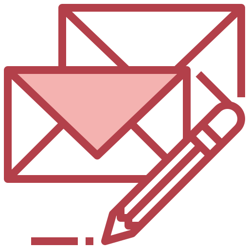

# Mail After Edit
## Emailed updates on your channel entries!

### NEW IN VERSION 2.1
- EE6 READY! Just drop it on in to any ExpressionEngine set up from EE3 to EE6!
- AUTHOR SENDING: Include the author on every one of their updated entries
- BCC: Hide email addresses for your updates!
- EMAILING: We've moved everything to EE's native mailer, so you can use any service you would like.
- LOGGING: Utilizing EE's native developer logging.

### PURPOSE
This EE3/4/5/6 addon sends an email to an individual or member group after a channel entry is created or updated.

### INSTALLATION
1. Copy entire folder to your `system/user/addons` folder.
2. On your EE backend, navigate to `Developer > Addons` (yoursite.com/admin.php?/cp/addons).
3. Scroll to `Third Party Add-Ons`.
4. Find `Mail After Edit` and click `Install`.
5. Add your settings, and enjoy!

### UPGRADING
If you are upgrading from version 1, the most important thing is to **leave your config.php in the addon directory**. We have moved from using a file to database-driven settings, in order to make upgrading and changes simpler.

After upgrading the addon files, move your config.php file back in to the `mail\_after\_edit`. When you click `Upgrade to 2.0`, your config settings will automatically be added to the addon, and you can safely delete the file from there.

### SETTINGS
#### EMAIL
Version 2 utilizes EE's native emailing by default. If you are updating and were using MAE's Mailgun set up, you can simply move your Mailgun info into EE's email settings (`/admin.php?/cp/settings/email` or `Settings` > `Outgoing Email`).

### MESSAGE_INFO
This Contains some basic your message information
+ **Start**: The starting line of the email message. Defaults to `An entry has been updated! See below for information.`

+ **End**: The ending line of the email message. Defaults to `Sent by Mail After Edit`.

+ **Domain**: The full domain name that you are using, without a trailing slash. Defaults to `http://example.com`, so definitely change this.

+ **From**: This is the email your email notifications will come from. This is applied to all channels unless you override in that particular channel's config. Defaults to `from@example.com`, so definitely change this.

+ **Force BCC**: This will force all emails to be sent as BCCed emails, instead of exposing emails in the To line of the email.

+ **Send Individually**: This will force all emails to be sent as individually. Though this does provide somme extra control, it also sends a number more emails. Use sparingly.

#### CHANNEL_CONFIG
This contains your channel information.

+ **Channel ID**: The ID of the channel you would like to set MAE up (you can )

+ **Type**: This can be set to *email* or *member_group*. Email is for individual email addresses that will be notified for a channel. Member Group will notify everyone who is a member of the assigned group.

+ **Email**: If the type is set to email, this is the email addresses you will send notifications to. Email addresses should be separated by pipes (|), i.e. `from@example.com|fromagain@example.com|awesomeemail@example.com`

+ **Groups**: If the type is set to member_group, this is the groups that will receive notifications re: this channel.

+ **From**: This is the email your email notifications will come from. This will override the MESSAGE_INFO setting

#### SKIP_FIELDS
These fields will be skipped in emails, as they are not used that much and will email you way too much. Defaults to `entry_date` and `submit`. Add whatever fields you like by their field name (not field label). Fields should be separated by pipes (|), i.e. `entry_date|submit|super_secret_field_that_shouldnt_be_emailed|password`

### LOGGING
By default, Mail After Edit will add data to your Developer logs, so you can track your emails. If, for whatever reason, it is unable to access the developer logging, MAE will create a small file in your MAE directory. You can access this file via the MAE settingsdashboard.

### TROUBLESHOOTING
1. Check the developer logs/MAE logs. Check to see if any EE mailer errors had occurred in there.
2. Check your EE Mail settings and send a test email.
3. Contact support for any additional assistance.

### USE
Set it and forget it! Once you have all the information in your settings, it will automatically send the email anytime an entry in that particular channel is created or updated.

### SUPPORT
We want to make sure you have what you need on this. Email <doug@triplenerdscore.net> for help.

### ATTRIBUTIONS
ICON: The Mail After Edit icon is too awesome to be my own work. Icons made by <a href="https://www.flaticon.com/authors/surang" title="surang">surang</a> from <a href="https://www.flaticon.com/" title="Flaticon">www.flaticon.com</a>